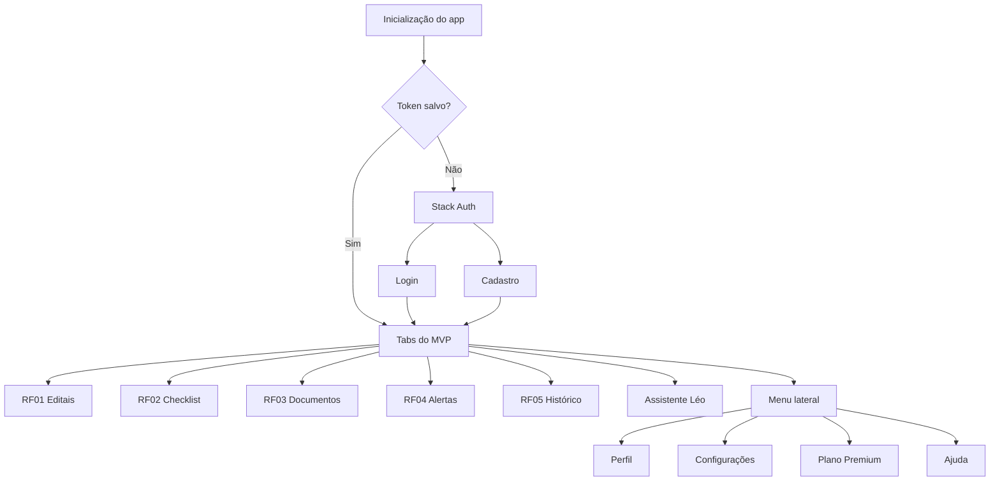

# Mapa de Navegação Mobile — LicitaME

**Disciplina:** Desenvolvimento Mobile - Projeto Integrador (2026.1)  
**Projeto:** LicitaME — Plataforma de Apoio à Concorrência Pública para MEIs  
**Tecnologia:** React Native + Expo Router  
**Participantes:** Luccas Fernandes, Gabriel Nogueira, Maria Eduarda Pernambuco, Luiz Henrique Cavalcanti, Nathalia Carvalho, Carlos Cavalcante

---

## Visão geral

O app mobile utiliza **Expo Router** com uma navegação principal em `Stack` e uma navegação interna em `Tabs`. O fluxo protege as telas autenticadas: usuários sem token salvo são enviados para login, enquanto usuários autenticados acessam as funcionalidades principais do MVP.

## Rotas implementadas

| Tipo | Rota | Arquivo | Objetivo |
|---|---|---|---|
| Stack | `/(auth)/login` | `mobile/app/(auth)/login.tsx` | Entrar com e-mail e senha |
| Stack | `/(auth)/register` | `mobile/app/(auth)/register.tsx` | Cadastro do MEI |
| Tab | `/(tabs)/index` | `mobile/app/(tabs)/index.tsx` | RF01: busca de editais |
| Tab | `/(tabs)/checklist` | `mobile/app/(tabs)/checklist.tsx` | RF02: checklist Lei 14.133/2021 |
| Tab | `/(tabs)/documentos` | `mobile/app/(tabs)/documentos.tsx` | RF03: documentos de habilitação |
| Tab | `/(tabs)/alertas` | `mobile/app/(tabs)/alertas.tsx` | RF04: alertas por preferências |
| Tab | `/(tabs)/historico` | `mobile/app/(tabs)/historico.tsx` | RF05: histórico de participações |
| Tab | `/(tabs)/leo` | `mobile/app/(tabs)/leo.tsx` | Assistente IA para dúvidas |
| Stack | `/perfil` | `mobile/app/perfil.tsx` | Edição de perfil |
| Stack | `/configuracoes` | `mobile/app/configuracoes.tsx` | Preferências do app |
| Stack | `/premium` | `mobile/app/premium.tsx` | Upgrade de plano |
| Stack | `/ajuda` | `mobile/app/ajuda.tsx` | Suporte e orientações |

## Decisões de navegação

- **Stack raiz:** separa autenticação, abas principais e telas auxiliares.
- **Tabs:** dão acesso rápido às cinco funcionalidades do MVP.
- **Menu lateral:** concentra perfil, configurações, plano premium e ajuda sem competir com as abas principais.
- **Proteção por autenticação:** `AuthContext` valida o token em `expo-secure-store` e redireciona o usuário conforme o estado de login.

