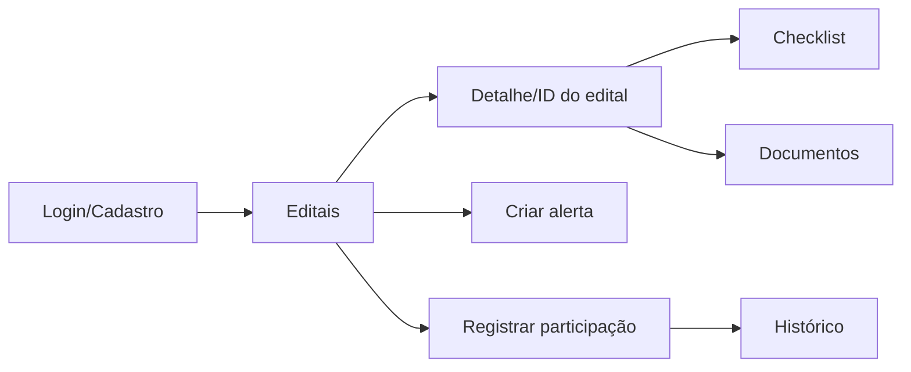

# Protótipo Mobile — LicitaME

**Disciplina:** Desenvolvimento Mobile - Projeto Integrador (2026.1)  
**Projeto:** LicitaME  
**Participantes:** Luccas Fernandes, Gabriel Nogueira, Maria Eduarda Pernambuco, Luiz Henrique Cavalcanti, Nathalia Carvalho, Carlos Cavalcante

---

## Objetivo do protótipo

O protótipo do app prioriza um fluxo simples para MEIs encontrarem editais, entenderem requisitos de habilitação e acompanharem prazos sem precisar navegar por sistemas públicos complexos.

## Telas previstas no MVP

| Tela | Fidelidade | Objetivo | Status no app |
|---|---|---|---|
| Login | Média | Acesso com e-mail e senha | Implementada |
| Cadastro | Média | Registro inicial do MEI | Implementada |
| Editais | Média | Busca e filtro de oportunidades | Implementada |
| Checklist | Média | Análise guiada de habilitação | Implementada |
| Documentos | Média | Upload e organização de arquivos | Implementada |
| Alertas | Média | Preferências e notificações de prazo | Implementada |
| Histórico | Média | Dashboard de participações | Implementada |
| Assistente Léo | Média | Apoio por IA para dúvidas | Implementada |
| Perfil e Configurações | Média | Dados do usuário e preferências | Implementadas |

## Fluxo de baixa/média fidelidade

## Critérios de prototipação

- Telas com hierarquia visual direta para uso em celular.
- Ações primárias sempre visíveis: buscar, salvar, enviar, criar alerta e registrar participação.
- Linguagem orientada ao MEI, evitando termos jurídicos sem contexto.
- Componentes nativos do React Native para manter compatibilidade com Expo Go.

## Link externo

Caso o protótipo visual seja publicado em Figma, registrar aqui o link final:

`A definir pela equipe`

